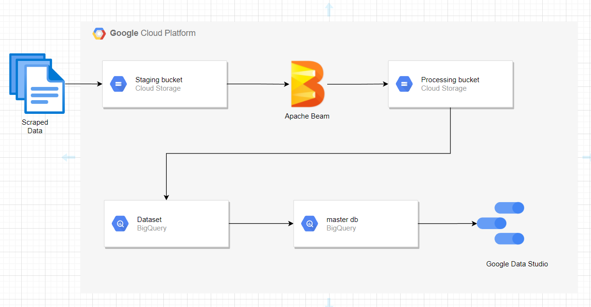

# Project For Data Engineering Task on GCP

## Table of contents
1. Introduction
2. Objective
3. Design
4. How it works
5. Contributions
## Introduction
The project is intended to provide details of Web Scraping a popular website 
www.naukri.com and extracting different fields of data available there to do
some analysis on different hot jobs being posted on the website.We specifically
made use of Google cloud products to perform different steps of the project
like VM to run a scheduled scraper,Apache beam to perform transformation,
cloud function to load csv files to Big-Query and Data Studio to analyze and
prepare reports.
## Objective 
To draw some insights out of the data we collected by making use of the Data
Enginnering practices through Google Cloud.
## Process Flow

## How it works
This project has been done in four major steps and a through explanation
has been provided in the README file of each segregated feature folder.

1. ##### Data Collection through a Scrapper

2. ##### Transformation of data through Apache Beam

3. ##### Loading processed data into BigQuery

4. ##### Preparation of dashboards through Data Studio to draw insights
## Contributions

